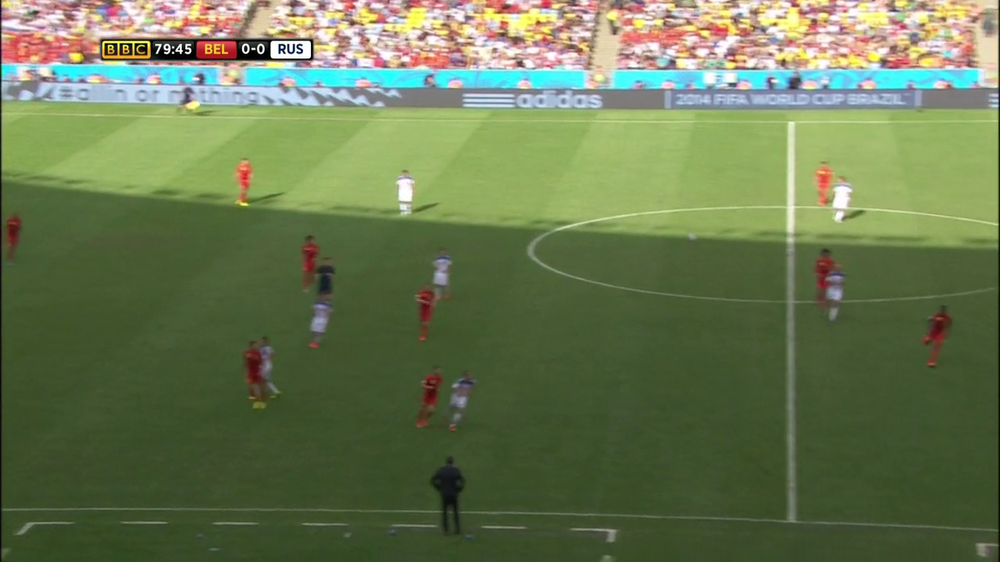
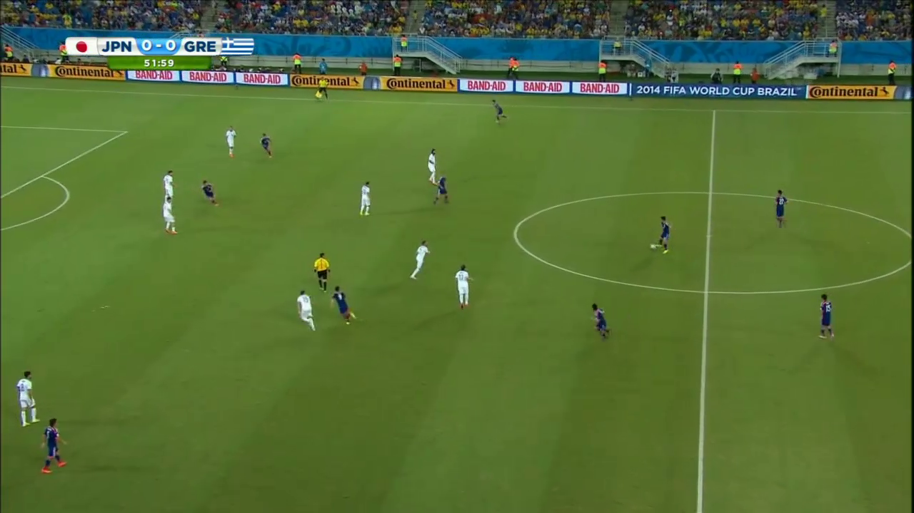
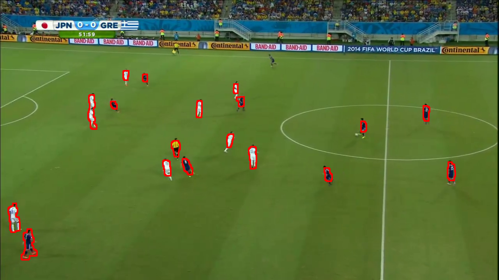
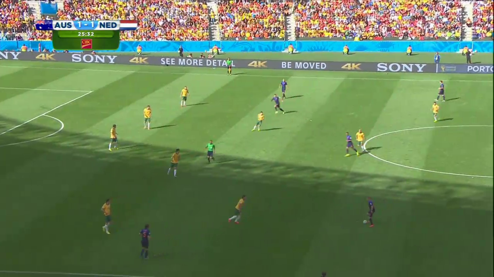
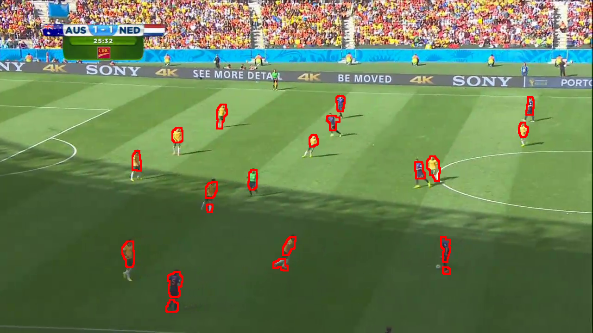
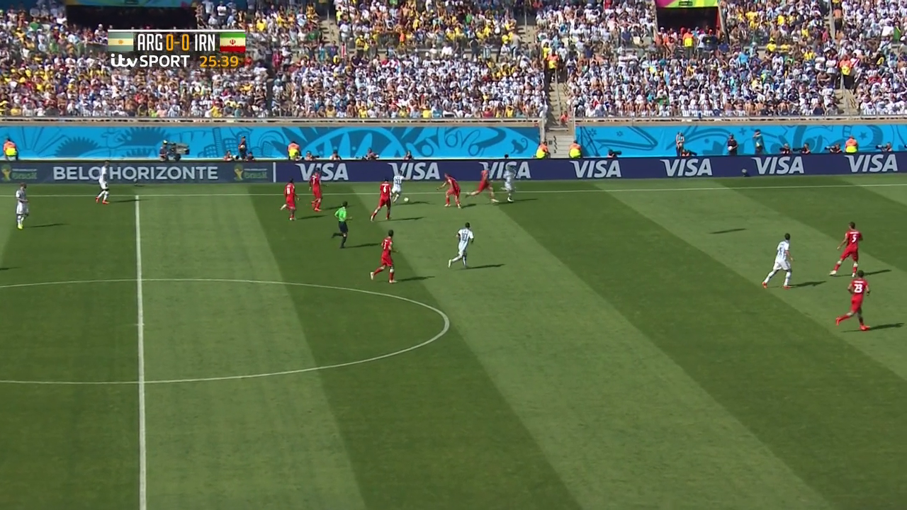
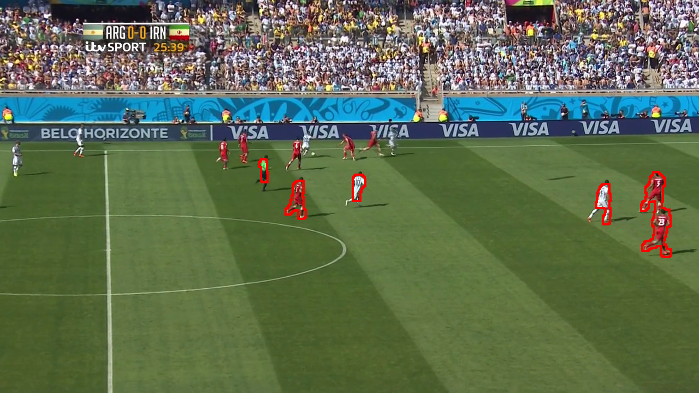

# Soccer-Player-Segmentation
Segment out the players from aerial images of soccer gameplays. This is a challenging task since most of the times there are shadows, global illumination is not constant, players wearing green tshirts are hard to distinguish from the ground etc.

## Results
Input                      | Output
:-------------------------:|:-------------------------:
          |  
          |  
          |  

#### Some failure cases
* When the shots start facing the field at a low angle, it almost becomes a forward view which makes it hard to distinguish the banners around the field from the players that are in front of the banners. Other issues are if the players are too small then they are not captured.
Input                      | Output
:-------------------------:|:-------------------------:
          |  
